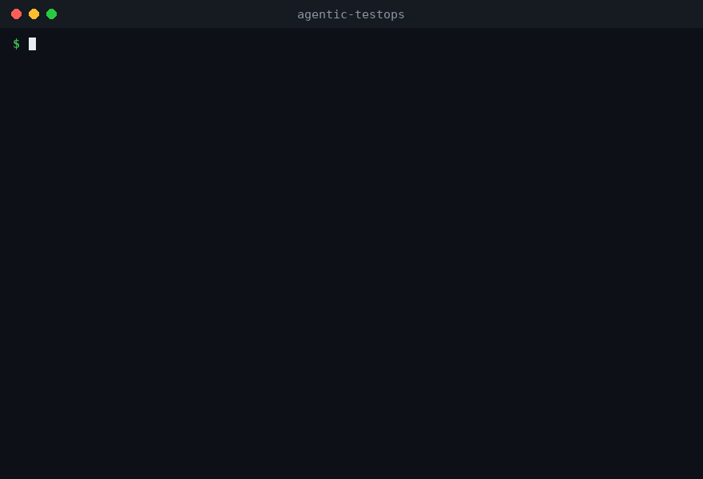

# Agentic TestOps

[](https://github.com/Strangelight-Merser/agentic-testops/actions/workflows/ci.yml)

[English](README.md) | 简体中文



Agentic TestOps 是一个可直接运行的 Python 仓库 TestOps 助手。它把一次失败的测试运行转化为结构化的工程报告：执行 `pytest`、解析失败用例、归类可能的根因、重跑失败测试，并产出面向修复的 Markdown/JSON 输出，既可供人工评审，也可传递给后续的代码修复 Agent。

项目聚焦于 Python 代码库的"实现 -> 验证 -> 诊断 -> 改进"闭环，用真实工具落地，而不是只停留在幻灯片演示。

## 10 秒演示

```bash
agentic-testops audit examples/service_health --rerun-failures --suggest-fixes
```

| 原始失败 | 结构化诊断 | 补丁建议目标 |
| --- | --- | --- |
| `FileNotFoundError` | `filesystem-boundary` | `service_health.py:9` |
| `AttributeError` | `object-interface` | `service_health.py:15` |
| `NameError` | `symbol-resolution` | `service_health.py:20` |

参见[演示讲解](docs/demo-walkthrough.md)、[Markdown 报告](docs/sample-service-health-report.md)和[机器可读 JSON](docs/sample-service-health-report.json)。

## 为什么做这个项目

现代 AI 编码工作流往往止步于代码生成。真实系统需要一条反馈回路：

1. 用开发者日常使用的同一条命令运行项目测试。
2. 从嘈杂的工具输出中提取失败信号。
3. 诊断问题属于行为回归、依赖、API 契约、数据形状还是输入校验。
4. 生成附带证据和具体修复建议的报告。
5. 把结果送入下一步调试或打补丁环节。

Agentic TestOps 实现了这条回路中第一个可运行的切片，行为确定性强，无需 API key 即可在 CI 中运行。

## 当前功能

- `agentic-testops audit <project>` 命令行工具。
- 在目标项目中运行 `python -m pytest --tb=short -q`。
- 优先从 JUnit XML 解析 pytest 失败，文本输出解析作为回退。
- 通过 `--rerun-failures` 只重跑已解析出的失败用例节点 ID。
- 通过 `--detect-flaky N` 检测不稳定（flaky）失败：每个失败用例额外重跑 N 次，分类为 `flaky`（不稳定）或 `consistent`（可复现），使补丁自动化可以跳过不稳定目标。
- 将 pytest 超时转化为结构化报告而不是直接崩溃。
- 聚焦重跑时保留用户提供的 pytest 参数。
- 诊断常见的 Python 失败类别：
  - 断言或行为回归
  - 依赖/导入失败
  - API 契约不匹配
  - 数据形状问题
  - 文件系统边界问题
  - 输入校验边界 bug
  - 对象接口不匹配
  - 符号解析错误
  - 收集/环境失败
- 生成专业的 Markdown 报告。
- 生成机器可读的 JSON，便于后续 Agent 编排。
- 生成补丁建议对象，包含目标文件、疑似行号、动作、理由、置信度和守护测试。
- 使用感知 import 的 AST 查找来定位 API 契约类补丁目标，再回退到保守的项目扫描。
- 通过 `--suggest-fixes` 或 `--fix-output` 生成保守的 dry-run 统一 diff 建议；service health 演示补丁可以干净地应用到临时副本并使其测试通过。
- 通过 `--apply-and-verify` 闭环验证：把建议补丁应用到项目的临时副本，在副本中重跑守护测试和全量测试，并在报告中给出 `fix-confirmed`、`fix-ineffective`、`fix-regressed` 或 `patch-failed` 结论。原项目始终不被修改。
- 通过 `--llm-explain` 启用可选的 LLM 分析层：把结构化失败证据发送给 LLM，在确定性诊断旁渲染顾问性的根因解释。通过 `--llm-provider` 和 `--llm-base-url` 同时支持 Anthropic API 和任意 OpenAI 兼容端点（OpenAI、DeepSeek、通义千问、智谱、Moonshot、本地 Ollama/vLLM）。没有 API key 时审计照常运行并打印跳过提示，不引入任何额外依赖。
- 以可复用 GitHub Action 的形式提供 CI 报告生成能力。
- 包含四个故意失败的示例项目，其中一个是确定性可复现的共享状态 flaky 示例。
- 包含单元测试、ruff 代码检查、严格 mypy 类型检查和 GitHub Actions CI。

## 真实世界评估

本工具在真实开源项目（more-itertools、tabulate、boltons）的历史 bug 上做过评估：采用类 SWE-bench 的"回退源码、保留测试"重放流程，并将结果与上游修复实际改动的文件和行号对照。评估结论——包括工具失误的地方——记录在 [docs/real-world-evaluation.md](docs/real-world-evaluation.md)，可通过 `scripts/evaluate_real_world.py` 复现。

## 演示工件

- [真实世界评估](docs/real-world-evaluation.md)
- [项目简介](docs/project-brief.md)
- [演示讲解](docs/demo-walkthrough.md)
- [Buggy calculator 报告](docs/sample-buggy-calculator-report.md)
- [Buggy calculator dry-run 修复](docs/sample-buggy-calculator-fixes.patch)
- [Task tracker 报告](docs/sample-task-tracker-report.md)
- [Task tracker dry-run 修复](docs/sample-task-tracker-fixes.patch)
- [机器可读 task tracker JSON](docs/sample-task-tracker-report.json)
- [Flaky pipeline 报告](docs/sample-flaky-pipeline-report.md)
- [机器可读 flaky pipeline JSON](docs/sample-flaky-pipeline-report.json)
- [Service health 报告](docs/sample-service-health-report.md)
- [Service health dry-run 修复](docs/sample-service-health-fixes.patch)
- [机器可读 service health JSON](docs/sample-service-health-report.json)
- [GitHub Action 用法](docs/github-action.md)

## 快速开始

从 PyPI 安装：

```bash
pip install agentic-testops
agentic-testops audit path/to/your/project
```

或从源码克隆使用：

```bash
python -m pip install -e ".[dev]"
python -m pytest
agentic-testops audit examples/buggy_calculator \
  --rerun-failures \
  --suggest-fixes \
  -o reports/buggy-calculator-report.md \
  --json-output reports/buggy-calculator-report.json \
  --fix-output reports/buggy-calculator-fixes.patch
```

如需传递额外的 pytest 参数，重复使用 `--pytest-arg`：

```bash
agentic-testops audit . --pytest-arg tests/test_parser.py --pytest-arg=-q
```

## GitHub Action

```yaml
- uses: Strangelight-Merser/agentic-testops@main
  with:
    project: "."
    output: reports/agentic-testops-report.md
    json-output: reports/agentic-testops-report.json
    fix-output: reports/agentic-testops-fixes.patch
    rerun-failures: "true"
    suggest-fixes: "true"
    job-summary: "true"
```

完整工作流（含 job summary 输出和工件上传）参见 [GitHub Action 用法](docs/github-action.md)。

示例项目会按预期失败：`divide(10, 0)` 抛出 `ZeroDivisionError` 而测试期望 `ValueError`，`average([])` 同样会除以零。这是有意为之，用于演示工具如何把原始 pytest 输出转化为修复建议。

覆盖多种失败类别的更大演示：

```bash
agentic-testops audit examples/task_tracker \
  --rerun-failures \
  --suggest-fixes \
  -o reports/task-tracker-report.md \
  --json-output reports/task-tracker-report.json \
  --fix-output reports/task-tracker-fixes.patch
```

覆盖文件系统、对象接口和符号解析失败的服务型演示：

```bash
agentic-testops audit examples/service_health \
  --rerun-failures \
  --suggest-fixes \
  -o reports/service-health-report.md \
  --json-output reports/service-health-report.json \
  --fix-output reports/service-health-fixes.patch
```

区分不稳定共享状态失败与可复现 bug 的 flaky 检测演示：

```bash
agentic-testops audit examples/flaky_pipeline \
  --detect-flaky 2 \
  -o reports/flaky-pipeline-report.md \
  --json-output reports/flaky-pipeline-report.json
```

报告中的 Flakiness Check 表格会把 `test_fetch_rates_includes_eur` 判定为 `flaky`（依赖缓存预热副作用），把 `test_convert_applies_rate_exactly` 判定为 `consistent`（真实的 off-by-one bug）。参见 [flaky pipeline 示例报告](docs/sample-flaky-pipeline-report.md)。

在确定性诊断之上叠加顾问性 LLM 分析，提供商任选：

```bash
# Anthropic
export ANTHROPIC_API_KEY=sk-ant-...
agentic-testops audit examples/buggy_calculator --llm-explain

# OpenAI
export OPENAI_API_KEY=sk-...
agentic-testops audit examples/buggy_calculator --llm-explain

# 任意 OpenAI 兼容端点（DeepSeek、通义千问、智谱、Moonshot 等）
export OPENAI_API_KEY=sk-...
agentic-testops audit examples/buggy_calculator --llm-explain \
  --llm-base-url https://api.deepseek.com --llm-model deepseek-chat

# 本地模型（Ollama / vLLM），无需 API key
agentic-testops audit examples/buggy_calculator --llm-explain \
  --llm-base-url http://localhost:11434/v1 --llm-model qwen3
```

`--llm-provider auto`（默认值）会根据已设置的 API key 自动选择协议。LLM 部分被明确标注为顾问性内容，绝不取代确定性输出；当 key 缺失或请求失败时审计会优雅降级（并打印提示），同一条命令在 CI 中依然安全。

## 输出示例

````markdown
# Agentic TestOps Audit Report

- Status: **FAIL**
- Parsed failures: `2`

## Agentic Rerun

- Status: **FAIL**
- Command: `python -m pytest --tb=short -q test_calculator.py::test_divide_rejects_zero ...`

## Diagnosis

### 1. `test_calculator.py::test_divide_rejects_zero`

- Category: `input-validation`
- Summary: The implementation likely misses validation for an invalid or boundary input.

Repair advice:
- Define the intended behavior for the boundary input: reject, clamp, or return a neutral value.
- Guard the operation close to the source of the invalid value.
- Document the behavior in a test so future agents preserve it.

## Patch Proposals

### 1. `test_calculator.py::test_divide_rejects_zero`

- Target: `calculator.py:2`
- Action: Add explicit validation for the failing boundary input before the unsafe operation.

## Dry-Run Fix Suggestions

These diffs are review previews only. They are not applied automatically.

```diff
--- a/calculator.py
+++ b/calculator.py
@@ -1,2 +1,4 @@
 def divide(a: float, b: float) -> float:
+    if b == 0:
+        raise ValueError("division by zero")
     return a / b
```
````

## 架构

```text
目标 Python 项目
        |
        v
Pytest 运行器
        |
        v
JUnit XML + stdout/stderr 捕获
        |
        v
失败解析器
        |
        v
基于规则的诊断 Agent
        |
        v
失败测试聚焦重跑
        |
        v
补丁建议规划器
        |
        v
Markdown / JSON 报告生成
        |
        v
人工评审或后续补丁生成 Agent
```

当前版本使用确定性诊断规则，因此无需 API key 即可运行。下一版本可以在结构化报告之上叠加可选的 LLM 层，但基础系统保持可复现、易评估。

## 仓库结构

```text
src/agentic_testops/
  cli.py          命令行入口
  runner.py       pytest 执行封装
  parser.py       pytest 输出解析器
  diagnoser.py    失败分类与修复建议
  patcher.py      结构化补丁建议规划器
  fixer.py        保守的 dry-run 统一 diff 建议
  flake.py        基于重复重跑的 flaky 失败检测
  llm.py          可选的顾问性 LLM 分析（Anthropic + OpenAI 兼容 API，标准库 HTTP）
  reporter.py     Markdown 与 JSON 报告生成
  models.py       共享数据类
examples/
  buggy_calculator/
  flaky_pipeline/
  service_health/
  task_tracker/
docs/
  project-brief.md
  sample-buggy-calculator-report.md
  sample-buggy-calculator-fixes.patch
  sample-service-health-report.md
  sample-service-health-fixes.patch
  sample-task-tracker-report.md
  sample-task-tracker-fixes.patch
tests/
.github/workflows/
  ci.yml
action.yml
```

## 项目状态

- 可运行的 CLI 和可复用 GitHub Action 已实现。
- Markdown、JSON 和 dry-run 补丁工件均由真实 pytest 运行生成。
- 优先使用 JUnit XML 解析，保守的文本解析作为回退。
- 聚焦重跑、超时报告和可移植命令渲染均有测试覆盖。
- 公开示例覆盖边界校验、API 契约、数据形状、空状态和共享状态 flaky 失败。
- flaky 检测在修复规划之前区分不稳定失败和可复现失败。
- 真实世界评估重放了 more-itertools、tabulate 和 boltons 的历史 bug，并对照上游修复 ground truth 如实记录命中与失误。
- 提供 issue、PR、贡献流程、发布检查和安全报告等维护文件。

## 维护

- [贡献指南](CONTRIBUTING.md)
- [更新日志](CHANGELOG.md)
- [安全策略](SECURITY.md)
- [发布检查清单](docs/release-checklist.md)
- [GitHub Action 用法](docs/github-action.md)

## 路线图

- 面向更多 Python 语法形态和调用模式的更安全的 AST 编辑规划。
- 在解释层基础上的 LLM 辅助补丁生成。
- GitHub Checks 集成，在 PR 上评论摘要。
- 针对重复失败和 flaky 信号的项目历史记忆。
- 多 Agent 角色：运行器、分诊器、补丁规划器、验证器。
- 覆盖率引导的测试缺口分析。

## 局限性

- 工具只建议修复，不直接编辑目标代码。
- pytest 输出解析刻意保守，可能漏掉特殊插件格式。
- 诊断规则是启发式的；报告旨在辅助人工评审，而非取代它。
- 补丁建议是规划提示，不是可执行的代码变更。
- dry-run diff 只覆盖保守模式，使用前应人工评审。

## 许可证

MIT
